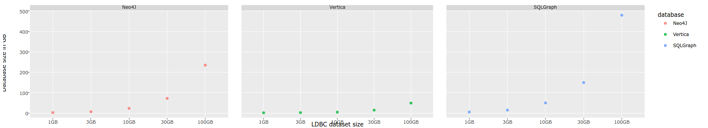
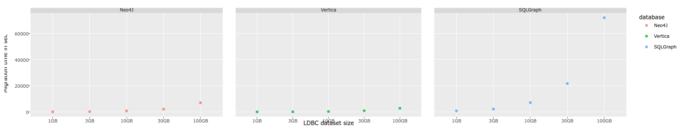
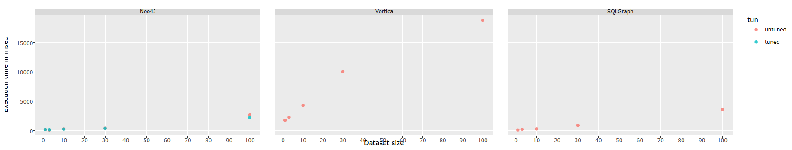
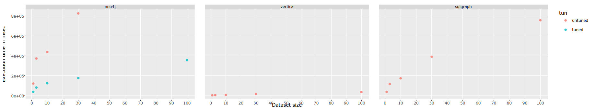
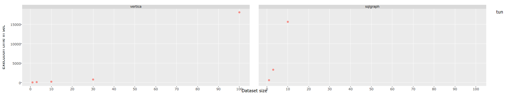
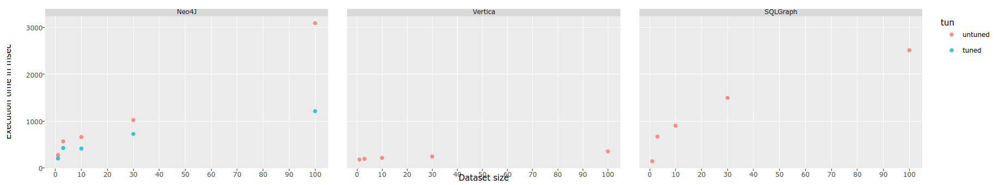

#Graph Query Engine Benchmark
The purpose of this project is to compare the ability of varying graph frameworks in a reproducible manner. We hope that this in turn will churn up interesting discussion about improvements that need be addressed at both the individual and overall level. 

To do this we chose the LDBC-SNB Data Generator [(read more here)][1] to create realistic social network graphs, and as a standard query base. We have also elected to use standardised hardware, the details of which can be found in the Hardware section below. 

For our initial tests we have chosen to compare [Neo4J][2], [SQLgraph][3] and [Vertica][4], but any extension to this would be very interesting. The details of these implementations can be found in their subfolders above.  

We have also created an R script which processes the raw data and allows the results to be viewed in a Web UI. This can be found in the Results folder above, and was used to generate the graphs seen in the results section below. 

###Disclaimer
Please note, that whilst we have tried our upmost to optimise the chosen frameworks to get the best result, we do not claim to be experts in their use. There could be several alterations we have overlooked that improve processing capabilities in any number of ways. This is first and foremost a community project and we hope that anyone who notices a flaw in this work will be able to help point us in the right direction or get involved themselves. 

## Hardware specifications

### Neo4J and SQLGraph Specs

As Neo4j community edition and sqlgraph are fundamentally single machine frameworks, we chose to use a server which could all but exclude the idea that hardware was the root cause of slow benchmarks. For this reason, both frameworks were ran under the same test environment, namely the [HP Proliant DL 980 G7][6]. This server was further altered to add an additional 2TB of Ram and CPU Cores. This was important for neo4j as it functions as an in memory framework to improve query execution times. 

```
8 x Intel(R) Xeon(R) CPU 4870 E7 (10 real cores each @ 2.40 GHz)
L1 cache: 320 kB
L2 cache: 2560 kB
L3 cache: 30 MB
RAM: 4TB @ 1066MHz
```

Running Ubuntu 14.04 LTS With Neo4J 2.3.4 Community edition, java-1.7.0-openjdk and MySQL 5.8.

**Note:** The community edition of Neo4j  was used as we wanted all the chosen frameworks to be freely available to the public. 2.3 was used instead of the 3+ as this is the version the LDBC queries were written for (they use HAS instead of EXISTS – this modification only happened between 2.3 -> 3). Whilst we have done some minor experimentation with the newer version (which achieved similar results to 2.3) it would be interesting if this was examined closer to see if the newer version holds greater improvements. 

###### System Tuning

While the majority of changes were performed around the individual frameworks, see Neo4J benchmark for query tunning, and SQLGraph benchmark for migration tunning. An additional change was made to the io scheduling, namely from deadline to noop. This was mainly done in favour for Neo4J.

### Vertica Specs

Vertica is a distributed framework and must be run on a cluster. This disallowed us from running it on the same server as above. The cluster we instead used was composed of three identical dedicated physical hosts with the following specs:

```
2 x Intel Xeon CPU X5650 (6 real cores each @ 2.667 GHz)
L1 cache: 192 kB
L2 cache: 1536 kB
L3 cache: 12288 kB
RAM: 96GB @ 1333MHz
SCSI Disk, 15000 rpm, 2TB
```

The connection between the hosts was done with 1GB ethernet.
All three ran Ubuntu 14.04 LTS with Vertica v7.2.

It's worth noting that above mentioned specs are considerably inferior in every aspect, to that of the official recommended specs, available [here][6]. It also worths noting that the sum of all hosts specs in the cluster is considerably inferior to the single machine used on Neo4j and sqlgraph testing. The distributed configuration also adds network communication overhead.

###### System Tuning

Only one change was made for the tuning of the cluster which was to disable CPU frequency scaling on every single host and enable hyper threading. The same configuration were performed on the server running Neo4j and sqlgraph.

##Benchmark Details
There are two main areas of focus for this project. The first is how fast the framework is able to ingest a given dataset (from raw csv to queryable db) and the size variation this causes (is the frameworks db smaller or larger than the raw data).

The second is how long it takes for the frameworks to run the chosen queries on each of the datasizes. Note we also use a modified version of [dstat][5] to monitor CPU/MEM/IO etc. but this is only for helping with optimisations and was disabled during the overall benchmark, used in the published version.

###Data sizes
We chose to use the following data sizes when performing the benchmarks:
```1GB, 3GB, 10GB, 30GB, 100GB```

This was to allow us to see how the different benchmarks varied over a range of sizes. Note: Whilst some may not consider 100GB to be "big data" we felt that this showed enough variety in size to get the conversation going, but would be very interested if someone continued this with 1TB+.

For a quick start without messing around with the LDBC gen, the 1GB data is available in a raw form [here][8] and two ingested forms [neo4j 2.3.4][9]  (the version used in this benchmark) and [neo4j 3.0.6][7] 

###Chosen queries
Out of the possible 14 LDBC queries found within the pdf, we chose to focus on 2,6,8,9 and 11. This is because several utilised cypher functions (a feature available within only neo4j) and were therefore not possible to implement in sqlgraph or vertica without substantial work. To make this slightly more interesting we also chose to look at how the frameworks dealt with graph traversals by increasing the number of hops in query 9 from 1 through to 5.

####Query 2 Recent Posts and Comments by your Friends
Given a start Person, find (most recent) Posts and Comments from all of that Person’s friends, that were created before (and including) a given date. Return the top 20 Posts/Comments, and the Person that created each of them. Sort results descending by creation date, and then ascending by Post identifier.

####Query 6: Tag Co-occurrance 
Given a start Person and some Tag, find the other Tags that occur together with this Tag on Posts that were created by start Person’s friends and friends of friends (excluding start Person). Return top 10 Tags, and the count of Posts that were created by these Persons, which contain both this Tag and the given Tag. Sort results descending by count, and then ascending by Tag name.

####Query 8: Recent Replies
Given a start Person, find (most recent) Comments that are replies to Posts/Comments of the start Person. Only consider immediate (1-hop) replies, not the transitive (multi-hop) case. Return the top 20 reply Comments, and the Person that created each reply Comment. Sort results descending by creation date of reply Comment, and then ascending by identifier of reply Comment.

####Query 9: Recent posts and comments by friends and friends of friends
Given a start Person, find the (most recent) Posts/Comments created by that Person’s friends or friends of friends  (excluding start Person). Only consider the Posts/Comments created before a given date (excluding that date). Return the top 20 Posts/Comments, and the Person that created each of those Posts/Comments. Sort results descending by creation date of Post/Comment, and then ascending by Post/Comment identifier.

####Query 11: Job referral
Given a start Person, find that Person’s friends and friends of friends (excluding start Person) who started Working in some Company in a given Country, before a given date (year). Return top 10 Persons, the Company they worked at, and the year they started working at that Company. Sort results ascending by the start date, then ascending by Person identifier, and lastly by Organization name descending.

##Results

###Data migration

#### Stored database size



The above image displays the size change across the three frameworks for all datasets used. 

Utilising the bulk ingester, Neo4J roughly doubles the size of the raw ldbc data after migration. This was far more promising than using the load csv counterpart which would attribute to a factor of up to 7 times. This increase was mostly contributed to by the number of log files (described further under the neo4j sub module).

Contrary to the above, Vertica's column-oriented automatic compression runs in background after the ingestion. It uses the data-format of each column to infer a optimum compression algorithm. For this reason, all databases waited several minutes until the disk footprint was measured. On Vertica side, the datasize used in the comparisson are the ones after creating projections.

Finally, SQLGraph has a massive increase in size, up to a factor of 5. This is because of the duplication of information stored in the primary and secondary adjacency tables but also the increase of data store attributed to by the JSON columns. 

####Database migration time



The database migration time, illustrated above exhibits the average ingestion time in relation to original data (before store).

The Neo4J bulk ingester was capable of processing roughly 1 gigabyte a minute, improving upon the cypher load csv alternative. Load csv would take over 40 minutes for the 1 gigabyte dataset and throw gc overhead exceptions for the rest. It is important to note that whilst the bulk ingester provides a respectable throughput, it can only be used for the initial ingestion. This mean it may not be used for following ACID transactions (see neo4j sub directory for more details).

Surprisingly, the Vertica framework took less than both Neo4J and sqlgraph whilst still having to deal with the overhead of data compression and transfering data over the network to the other hosts in the cluster.

Finally, the mysql 'load csv in file' operation was the slowest of the three. Whilst attempts were made to improve the ingestion time (this includes both innodb and environment tuning), the migration was still order of magnitude higher than that of Neo4J or Vertica.

###Query executions

Below is an extract of the results showing the execution time across a variety of queries. Whilst no one framework preformed better than the rest across the board, we were most suprised at the time taken by Neo4J when preforming graph traversals (see query 9 and 11). In fact query 9 would often timeout ( > 6 hours) when executed with a depth of 4+ (illustrated by the complete absence of neo4j from  Query 9, 5 hops). Vertica, however, performed these traversals in a much shorter time. This is interesting as we assumed a framework specifically for graph processing would handle traversals better than a more general RDBMS. 

It is also important to note that whilst SQLGraph seems to normally fit in-between neo4j and vertica, this was run without any tuning made to the innoDB nor the server environment (see SQL directory for more details). 

####Query 6


####Query 9, 2 hops


####Query 9, 5 hops

Note: The large jump in time between 30GB and 100GB for the Vertica cluster can be attributed to data spilling to disk during the traversal. We do not believe this would be the case on a larger cluster where more memory would be available.

####Query 11


[1]:https://github.com/ldbc/ldbc_snb_docs/blob/master/LDBC_SNB_v0.2.2.pdf
[2]:https://neo4j.com/
[3]:http://static.googleusercontent.com/media/research.google.com/en//pubs/archive/43287.pdf
[4]:https://my.vertica.com/docs/7.2.x/HTML/
[5]:http://dag.wiee.rs/home-made/dstat/
[6]:https://www.hpe.com/h20195/v2/getpdf.aspx/c04128191.pdf?ver=43
[7]:https://drive.google.com/file/d/0B0uip08Km2LPc0d0M0JBYmdKWms/view?usp=sharing 
[8]:https://drive.google.com/file/d/0B0uip08Km2LPUTAyaUgyV2VybVk/view?usp=sharing
[9]:https://drive.google.com/file/d/0B0uip08Km2LPRmN1SXRELXM3blk/view?usp=sharing
